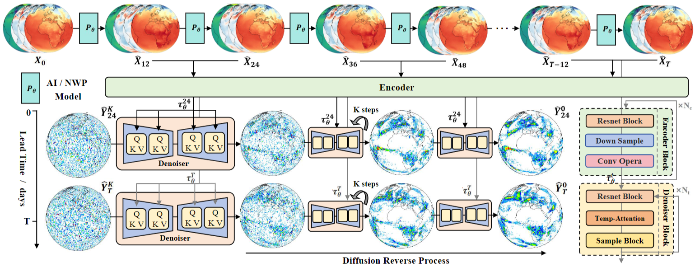
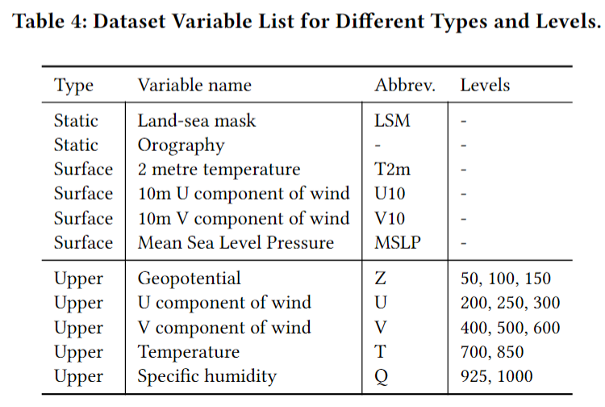
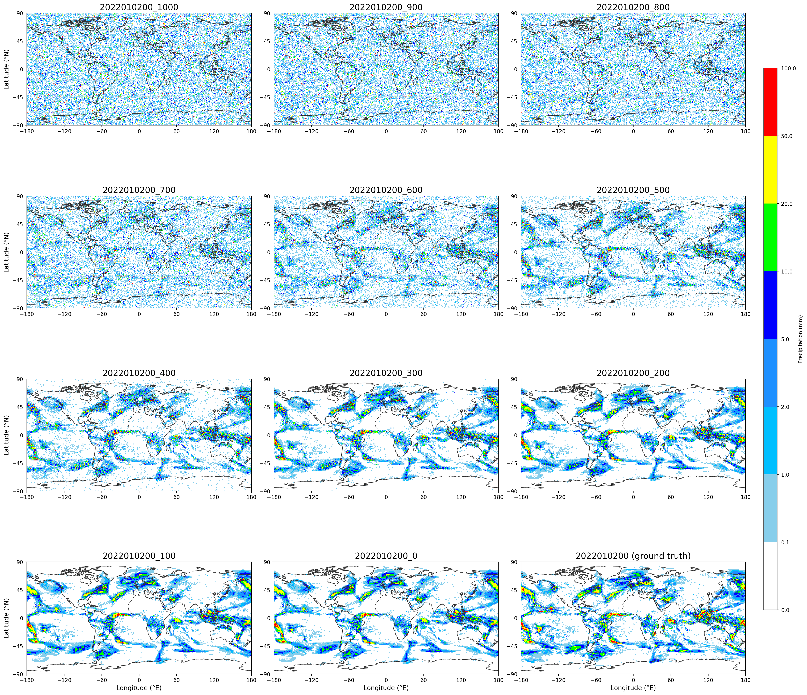
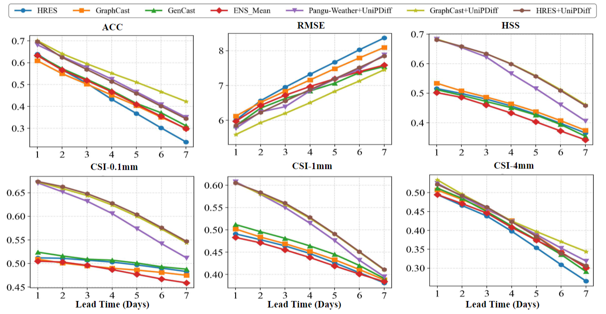
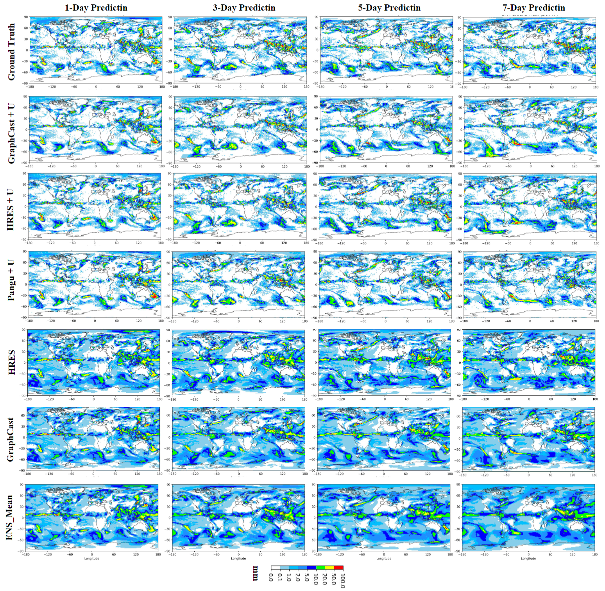
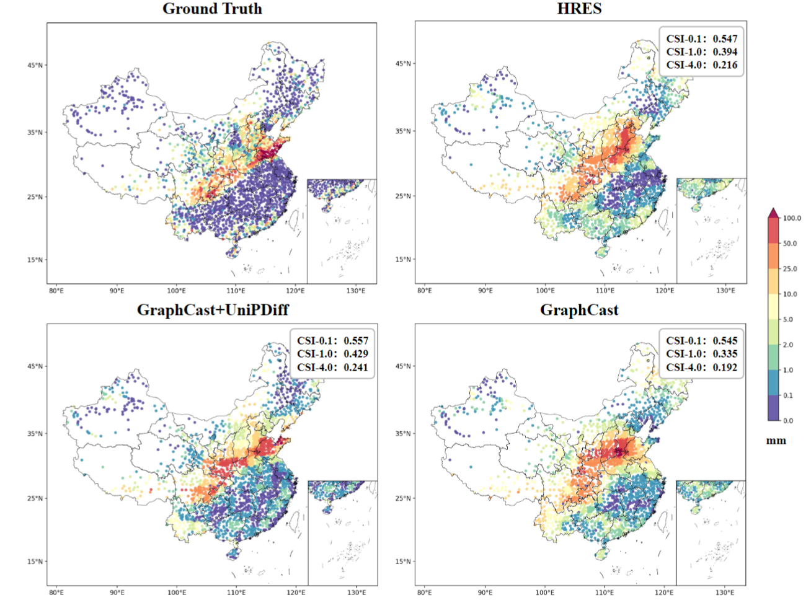

# UniPDiff

This is a training code for UniPDiff.

## Framework



## Conda Environment Installation 

```bash
conda create -n unipdiff python=3.10

conda activate unipdiff

pip install torch==2.5.1 torchvision==0.20.1 torchaudio==2.5.1 --index-url https://download.pytorch.org/whl/cu118
conda install -c conda-forge xarray==2025.1.2 numpy==2.1.3 pandas==2.2.3 dask netCDF4 bottleneck

pip install -r requirements.txt
```

## Data preparation

### ERA5 and IMERG Precipitation

The ERA5 dataset requires the following core atmospheric variables:



## Training Code

```bash
cd src
sh script_run_train.sh
```

## Denoising process demonstration



## Model performance display



## Visualization effect display



